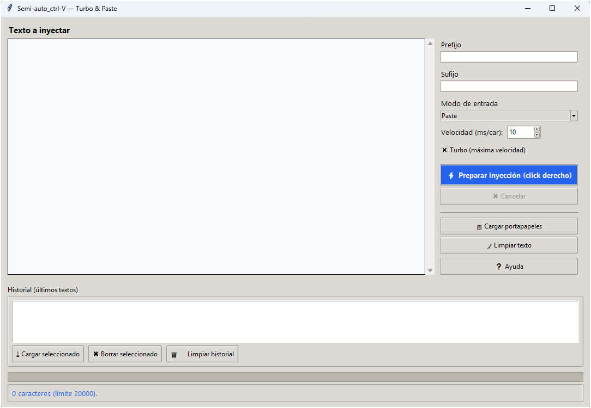

# 🧠 Semi-auto Ctrl-V (SmartInjector)


> ✨ *Cuando no puedes hacer Ctrl + V… crea tu propio Ctrl + V.*

---

## ⚡ Descripción

**Semi-auto Ctrl-V (SmartInjector)** es una pequeña herramienta creada para **entornos sin interfaz gráfica** (máquinas virtuales, consolas o servidores remotos)  
donde el copiar y pegar convencional no funciona.  

Permite **inyectar texto automáticamente** donde hagas clic derecho, simulando el tecleo o el pegado del texto preparado.  
Una solución ligera, sin dependencias externas y totalmente portable.

---

## 🖼️ Vista previa



---

## 🚀 Características

- 🖱️ Inyección de texto con clic derecho  
- ⚙️ Modos: **Paste**, **Type** y **Hybrid**  
- ⏱️ Control de velocidad + **Modo Turbo**  
- 🧩 Campos de **Prefijo** y **Sufijo**  
- 🧠 Mantiene mayúsculas/minúsculas originales  
- 💾 **Historial** de textos recientes  
- 💬 Tooltips explicativos en los campos  
- 🪶 Interfaz limpia, clara y ligera  

---

## 💾 Descargar versión compilada

[](https://github.com/Dasge97/semi-auto-ctrlv/releases/download/v1.6.2/smartinjector.exe)

> No requiere instalación.  
> Ejecuta el `.exe`, escribe o pega tu texto y haz clic derecho donde quieras inyectarlo.

---

## 🧰 Ejecutar desde el código fuente

Si prefieres usar el código Python:

```bash
# 1. Clonar el repositorio
git clone https://github.com/TU_USUARIO/semi-auto-ctrlv.git
cd semi-auto-ctrlv/src

# 2. Crear entorno virtual (opcional)
python -m venv .venv
.\.venv\Scripts\activate

# 3. Instalar dependencias
pip install -r requirements.txt

# 4. Ejecutar
python smartinjector.py

